# HealthSphere

Multi-tenant healthcare SaaS for clinics to manage patients, appointments, and medical records — with three dedicated portals (Admin, Doctor, Patient) and role-based access control within a shared instance.

**Live demo:** [health-sphere-sooty.vercel.app](https://health-sphere-sooty.vercel.app)

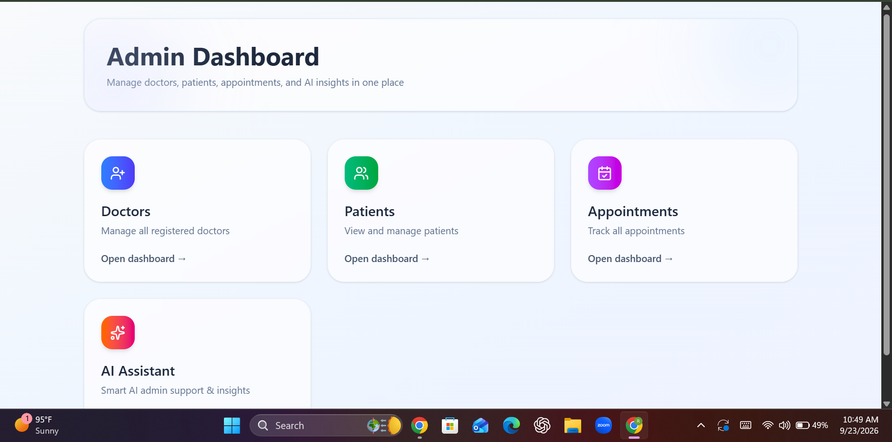

## Features

- 🏥 **Three role-based portals** — Admin, Doctor, and Patient, each with a dedicated dashboard and permissions
- 🔐 **JWT authentication with RBAC** — secure signup/login, role-based route access
- 👨‍⚕️ **Doctor management** — admins add, edit, and remove doctors with specialization, fee, and clinic details
- 🧑‍🤝‍🧑 **Patient management** — view registered patients and their records across the platform
- 📅 **Appointment scheduling** — patients book appointments with a chosen doctor, date, time, and reason for visit
- 🕐 **Doctor availability** — doctors configure their weekly working hours, day by day
- 📁 **Medical records** — patients can access their health history in one place
- ⚡ **Real-time updates** — powered by Socket.io
- 📱 **Responsive UI** — built with Tailwind CSS

## Screenshots

### Admin Portal
| Dashboard | Doctors List | Patients List | Appointments |
|---|---|---|---|
|  | 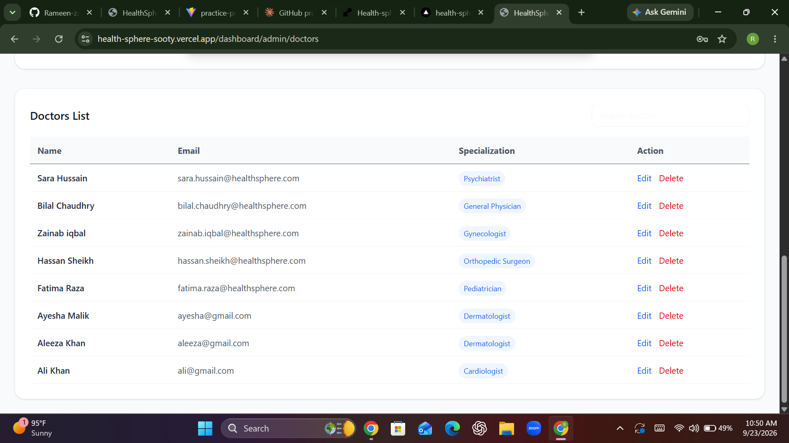 | 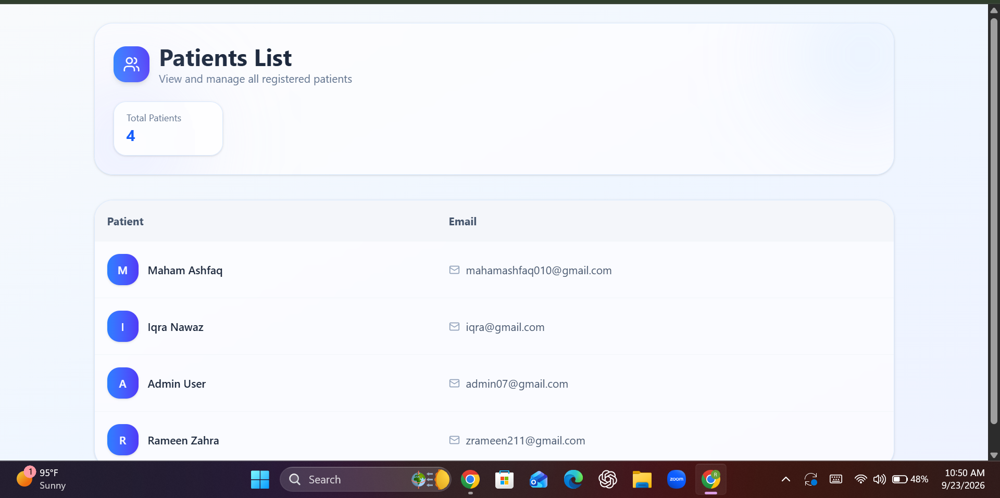 | 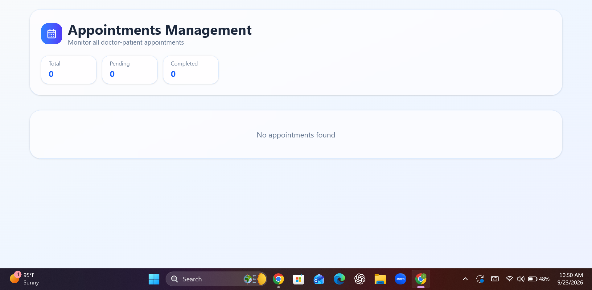 |

### Doctor Portal
| Dashboard | Profile | Patients | Availability |
|---|---|---|---|
| 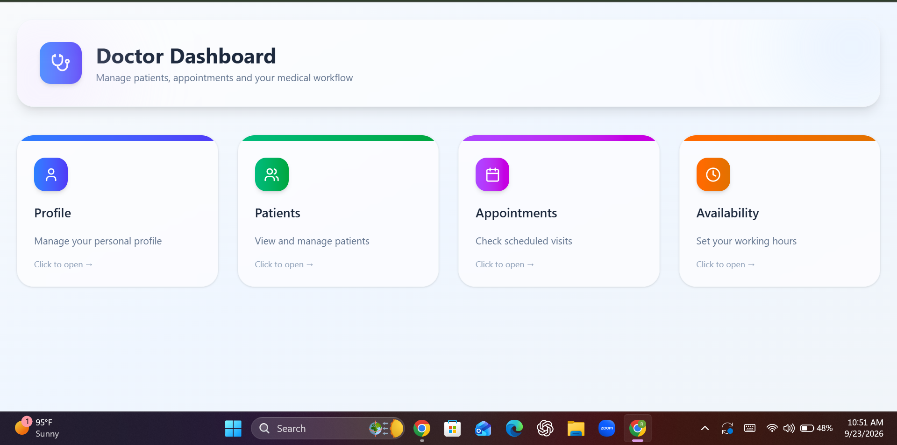 | 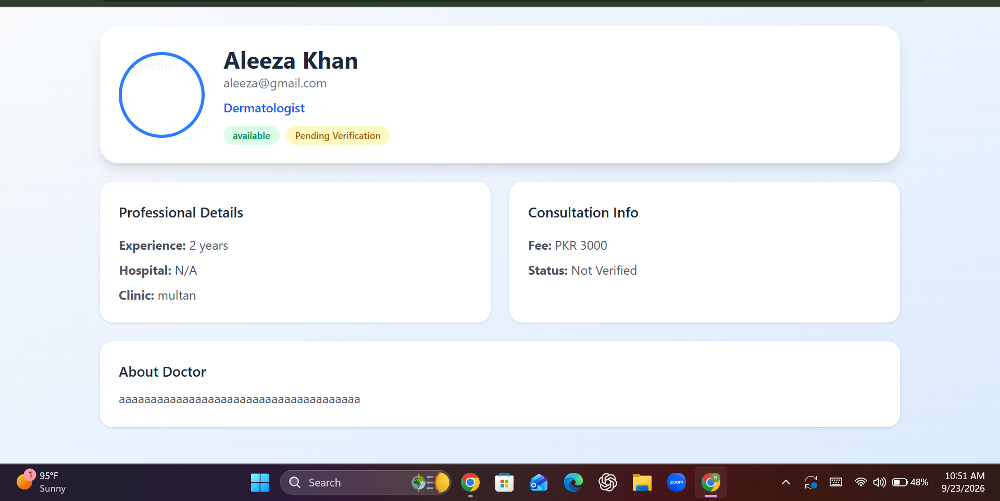 | 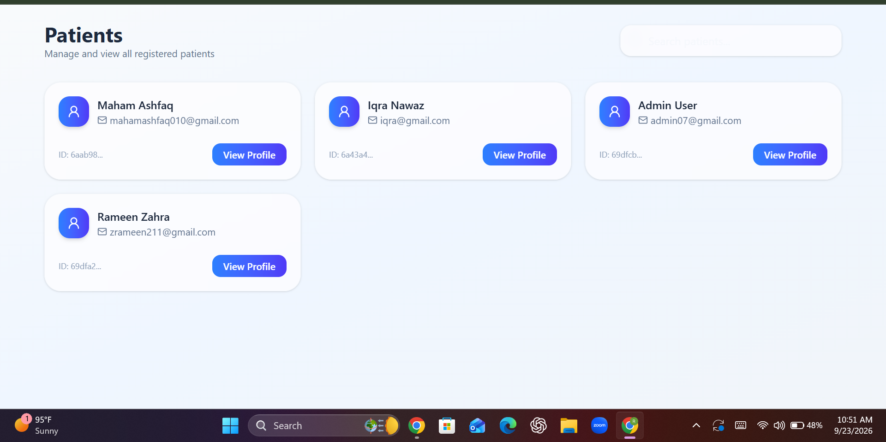 | 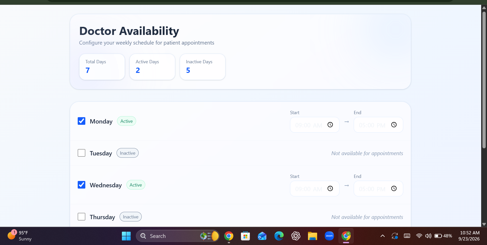 |

### Patient Portal
| Sign Up | Dashboard | Book Appointment | Profile | Medical Records |
|---|---|---|---|---|
| 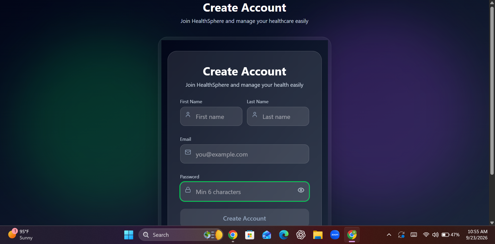 | 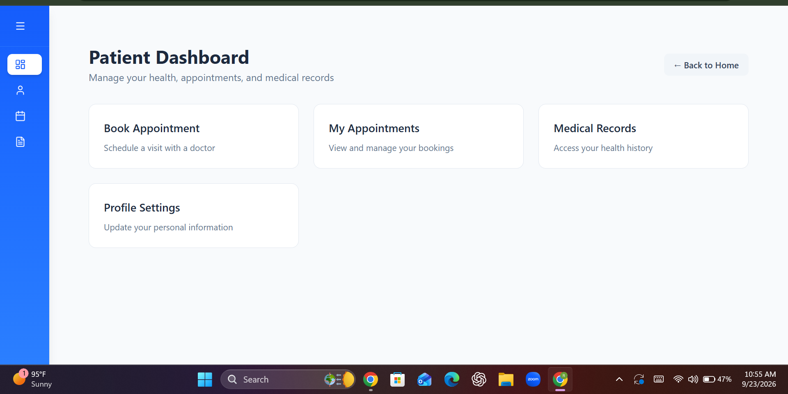 | 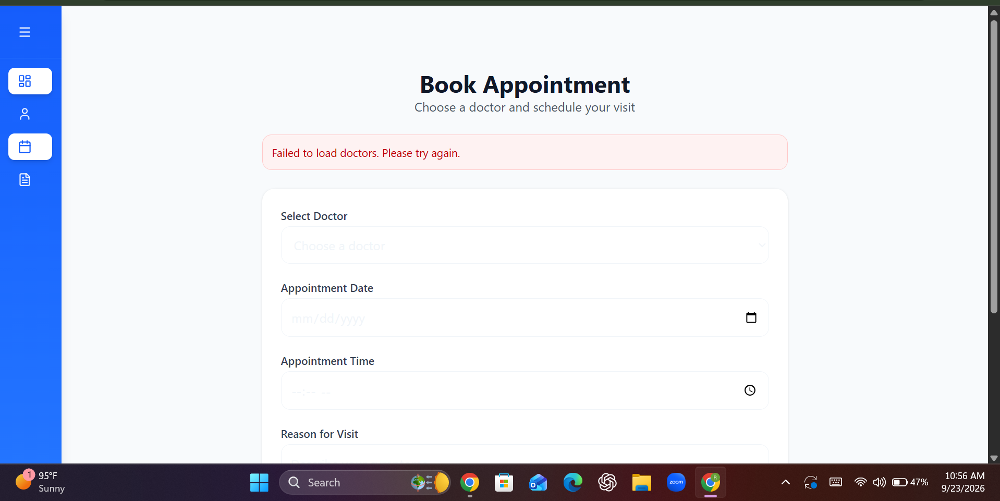 | 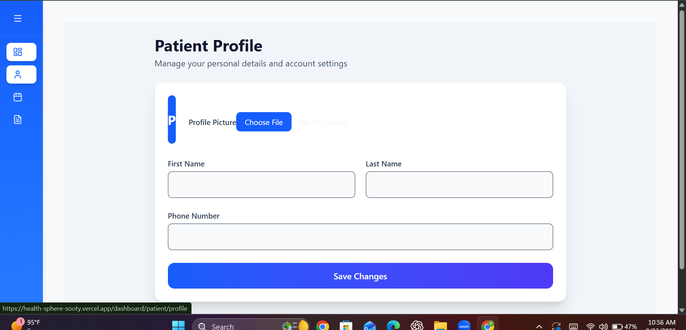 | 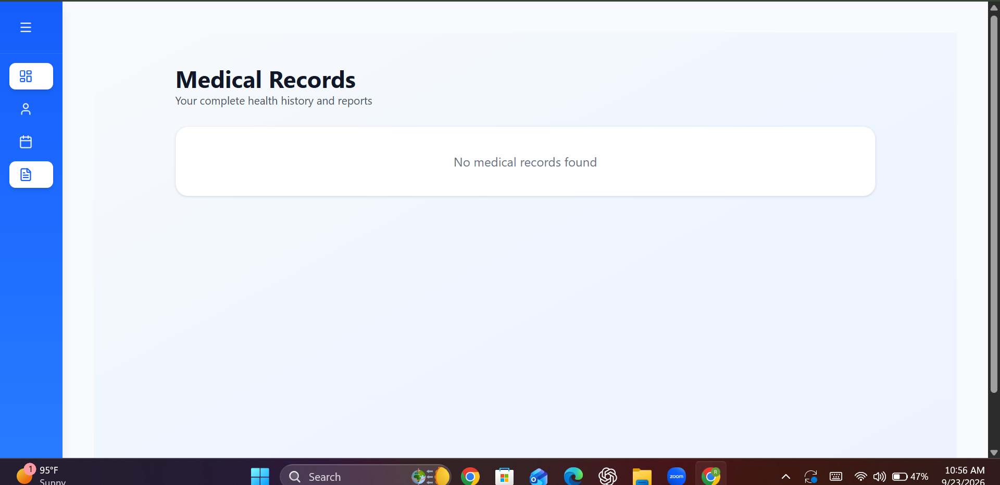 |

## Tech Stack

**Frontend**
- Next.js (App Router)
- TypeScript
- Tailwind CSS

**Backend**
- Node.js / Express (`/backend`)
- Socket.io for real-time communication
- JWT for authentication, role-based access control (RBAC)

**Deployment**
- Frontend: [Vercel](https://vercel.com)
- Backend: [Render](https://render.com)

## Project Structure

```
health-sphere/
├── app/          # Next.js frontend (App Router)
├── backend/      # Express API server, Socket.io, auth & RBAC logic — deployed on Render
├── public/       # Static assets
└── logs/         # Server logs
```

## Getting Started

### Prerequisites
- Node.js 18+
- npm / yarn / pnpm

### Installation

```bash
# Clone the repo
git clone https://github.com/Rameen-zahra2004/Health-sphere.git
cd Health-sphere

# Install frontend dependencies
npm install

# Install backend dependencies
cd backend
npm install
```

### Environment Variables

Create a `.env.local` in the root and a `.env` in `/backend` with values such as:

```
# Frontend (.env.local)
NEXT_PUBLIC_API_URL=https://health-sphere-1eg4.onrender.com

# Backend (backend/.env)
PORT=5000
MONGODB_URI=your_mongodb_connection_string
JWT_SECRET=your_jwt_secret
```

### Running Locally

```bash
# Run the backend
cd backend
npm run dev

# In a separate terminal, run the frontend
npm run dev
```

Frontend runs at `http://localhost:3000`, backend at `http://localhost:5000` (adjust to your setup).

### Deployment

- The **frontend** is deployed on **Vercel**, connected directly to this repo for automatic deployments — live at [health-sphere-sooty.vercel.app](https://health-sphere-sooty.vercel.app)
- The **backend** (Express API + Socket.io server) is deployed separately on **Render** as a web service — live at [health-sphere-1eg4.onrender.com](https://health-sphere-1eg4.onrender.com)

## Roadmap

See [TODO.md](./TODO.md) for planned features and known issues.

## Author

**Rameen Zahra**
- GitHub: [@Rameen-zahra2004](https://github.com/Rameen-zahra2004)
- LinkedIn: [rameen-zahra-5a31a7381](https://www.linkedin.com/in/rameen-zahra-5a31a7381)
